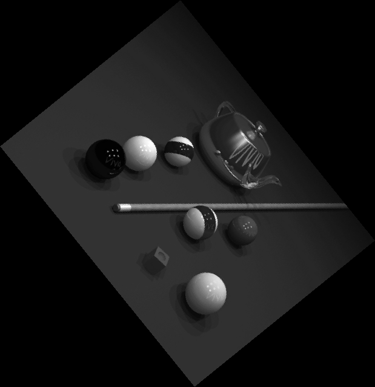
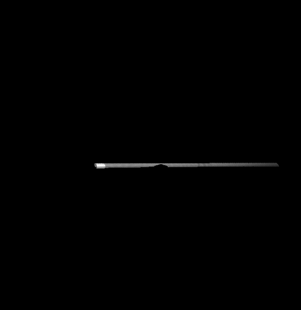

# image-elements-detection
Several processing techniques to detect corners-edges and isolate image elements.

## Notes

* Notebook developed in Jupyter
* The whole code lies in ImageProecessing.ipynb

## Tasks
1.  
    *  Find the main edges of *image11.jpg*  
     

 
    *  Estimate the angle (with respect to the horizontal axis) of the diagonal edges of the 
roof.  
    *  Find the corners of the image11.jpg.  
    *  Based on the detected corners, locate the windows.   

2.  
    *  Estimate the angle with respect to the horizontal axis of the billiard cue in *image31.png*. To verify the answer, rotate the input image accordingly. The result should be similar to *image32.png*.  
      

 
     

 
    *  Combine *image31.jpg* and *image32.jpg* to generate an image similar to *image33.jpg*.  
      

 

